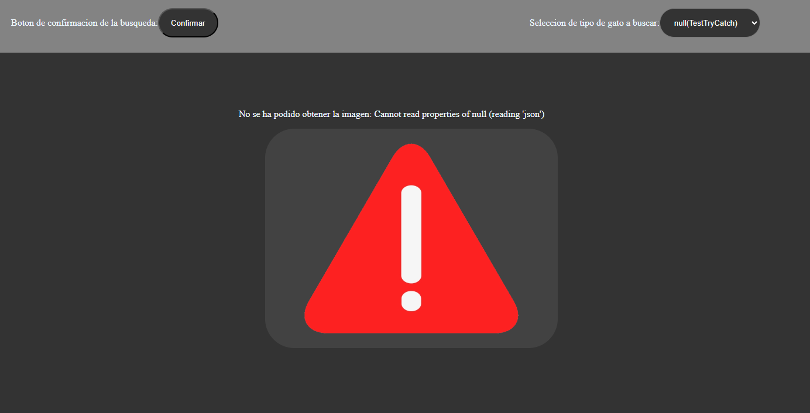

## Proyecto
El proyecto es una prueba con una API ,funciones Async y Promesas en JS. 

La API en cuestion es [The Cat API](https://thecatapi.com/) la cual he utilizado para hacer testeos con la misma en forma de una pagina sencilla, la cual tiene la funcionalidad de mostrarte un gato aleatorio de una de 5 opciones a seleccionar, siendo estas: 
- **Siames**
- **Bambino**
- **Bengal**
- **Gato Aleatorio**
- **Null**

El tipo Null está ahi solo para probar si el reconocimiento de errores funciona adecuadamente.

Si quieres visitar la pagina haz click [aquí](https://josemlg03.github.io/T4.2_LombaJose/)

## Funcionamiento

La pagina funciona de manera en la que tienes **1 boton** y **1 comboBox**, al hacer la seleccion del tipo de gato que quieras buscar en el comboBox y la confirmacion dandole al boton de Confirmar, se hara una solicitud a la API para mostrarte un gato del tipo que has solicitado previamente mediante el siguiente codigo: 
<BR><BR>

### JavaScript (script.js)
#### Método ObtenerImagenDeGato
El siguiente código es una **Promesa** la cual hace una solicitud a la API mediante Fetch y filtra con IFs según la selección del comboBox para conseguir la imagen del gato en cuestión.

En caso de no encontrar una imagen por cualquier motivo, el catch saltará y devolverá un null.
```
export function obtenerImagenDeGato() {
    return new Promise(async (resolve, reject) => {
        try {
            const select = document.getElementById('razaGato').value;
            let response = null;

        if (select === "siames") {
            response = await fetch('https://api.thecatapi.com/v1/images/search?breed_ids=siam');
        }
        if (select === "bambino") {
            response = await fetch('https://api.thecatapi.com/v1/images/search?breed_ids=bamb');
        }
        if (select === "bengal") {
            response = await fetch('https://api.thecatapi.com/v1/images/search?breed_ids=beng');
        
        }
        if (select === "aleatorio") {
            response = await fetch('https://api.thecatapi.com/v1/images/search');
        }

        const data = await response.json();
        const imageUrl = data[0].url;


        resolve(imageUrl);

        } catch (error) {
            reject(new Error("No se ha podido obtener la imagen: " + error.message));
        }
    });
}
```
#### Método mostrarImagenDeGato

Este código es una función Async que recibe la imagen del gato obtenida mediante el método visto anteriormente.

Al recibir la imagen del gato en cuestión, en caso de no ser null y que todo funcione como debe, se rellena la etiqueta img que está en el HTML con el gato obtenido y mediante CSS se le redondean los bordes y se le restringe el tamaño máximo que puede ocupar para que no se salga de unos límites (500px de alto y ancho).

Si recibe un null, saltará el catch y mostrará un mensaje de error con el error en cuestión y una imagen de una señal de alerta.

Si todo vuelve a ir bien, simplemente se sustituirá el error por el gato solicitado y la página seguirá funcionando apropiadamente.
```
export async function mostrarImagenDeGato() {
    
    const boton = document.getElementById("botonGato");
    let ErrorMensaje = document.getElementById("errorMensaje");
        

    boton.addEventListener('click', async () => {
        try {
            const imageUrl = await obtenerImagenDeGato();
            const img = document.getElementById("GatoImagen");
            img.src = imageUrl;
            document.body.appendChild(img);

            ErrorMensaje.textContent = "";
        } catch (error) {
                
            let ErrorMensaje = document.getElementById("errorMensaje");
            ErrorMensaje.textContent = error.message;

            const img = document.getElementById("GatoImagen");
            img.src = "Assets/error.png";
            document.body.appendChild(img);
        }
    });
}
```
## Testeo try/catch/throw/error

Para hacer que el error salte simplemente se selecciona **"Null"**, en el comboBox de gatos y se le da a **"Confirmar"**, y saldrá error de que el Json no se ha podido leer por lo que no se ha podido recuperar la imagen del gato a mostrar. De la siguiente manera:



---